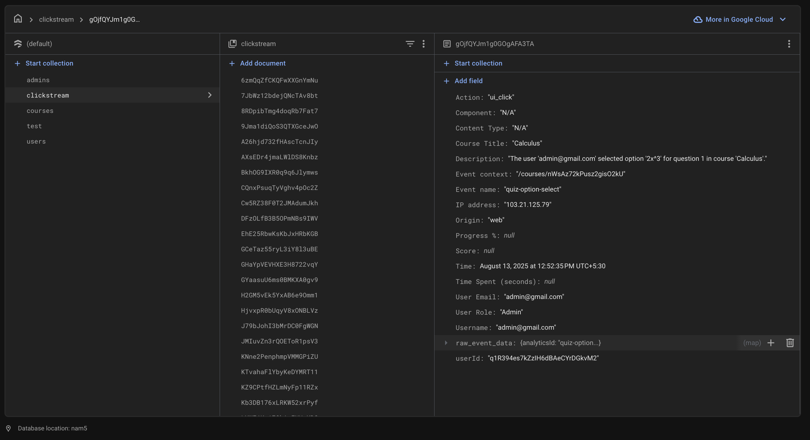

## LearnX: E-Learning Platform with Advanced Analytics

**Sanchita Chaurasia**

### Project Overview

LearnX is a comprehensive, full-stack e-learning platform built from the ground up using **React** and **Firebase**.

It provides a complete ecosystem for online learning, featuring:

  * A user-facing application for students to browse, register, and learn.
  * A powerful, **role-based admin dashboard** for complete management of courses, content, users, and analytics.
  * A core focus on **clickstream tracking** to generate deep, actionable insights into learning patterns.

**Live Demo:** [https://assignment2-82dfb.web.app](https://assignment2-82dfb.web.app)

-----

### Technology Stack

  * **Frontend:** React.js
  * **Backend & Database:** Firebase (Firestore, Authentication, Hosting)
  * **Styling:** Tailwind CSS
  * **Routing:** React Router (`react-router-dom`)
  * **State Management:** React Hooks & `react-firebase-hooks`
  * **Key Libraries:**
      * `recharts` for data visualization
      * `papaparse` for CSV export
      * `react-youtube` for video playback

-----

### Features for Learners

  * **Authentication:** Secure registration and login with persistent sessions across browser refreshes.
  * **Course Learning:** Browse courses, view dynamic content (text, video, quizzes), mark lessons as complete, and track overall progress with visual indicators on the main dashboard.
  * **Interactive Quizzes:** Take quizzes with multiple question types (multiple choice, text, number) and receive instant scoring and feedback.
  * **Personal Analytics Dashboard:** View personal learning statistics, including total time spent on courses, average quiz scores, and a detailed log of recent activity.

-----

### Features for Admins

  * **Role-Based Dashboard:** A secure `/admin` route accessible only to users with a designated admin role, protecting sensitive management functions.
  * **Full User Management:** View all registered users in the system and dynamically promote regular users to admins or revoke admin status with a single click.
  * **Full Course & Content Management (CRUD):**
      * Create, read, update, and delete entire courses.
      * Manage course content by adding, removing, and editing individual lessons and quiz questions.
  * **Advanced Quiz Editor:** A dynamic interface to edit quizzes, change question types (e.g., from multiple choice to text input), and modify options and correct answers on the fly.
  * **System Analytics:** Monitor system-wide statistics with summary cards and charts that visualize event frequency.
  * **CSV Export:** Download the complete, raw clickstream data for all users for external analysis or reporting.

-----

### The Clickstream Analytics System

The analytics system uses a **hybrid approach** for optimal and detailed data collection:

  * **Global Event Listener:** A single listener captures all general UI clicks on elements tagged with a `data-analytics-id` attribute. This is efficient for tracking navigation and simple interactions without cluttering components.
  * **Manual Event Logging:** For complex, state-dependent events, logging is done manually within the component. This is crucial for capturing rich data that isn't available from a simple click, such as:
      * **Time Spent:** Calculated in the `VideoContent` component by tracking play and pause timestamps.
      * **Quiz Scores:** Logged in the `QuizComponent`'s `handleSubmit` function to include the final score and total questions.
      * **Successful Logins/Registrations:** Logged after the asynchronous Firebase authentication call succeeds.

Every event is enriched with contextual data (user email, IP, course title) and a human-readable description, which is saved to Firestore and printed to the console for live debugging.

-----

### Firestore Data Structure

The database is structured into four main collections for scalability and security:

  * **`courses`**: Stores course details and a sub-collection for its content.
  * **`users`**: Stores user-specific data like registered courses and progress.
  * **`admins`**: A simple collection where document IDs are the UIDs of admin users.
  * **`clickstream`**: Stores all logged user interaction events in a detailed, structured format.

-----

### Live Demo & Code

  * **Live Application:**
    [https://assignment2-82dfb.web.app](https://assignment2-82dfb.web.app)

  * **GitHub Repository:**
    [https://github.com/sanchitachaurasia/Learning-Website-with-Clickstream.git](https://github.com/sanchitachaurasia/Learning-Website-with-Clickstream.git)

-----

### Q\&A